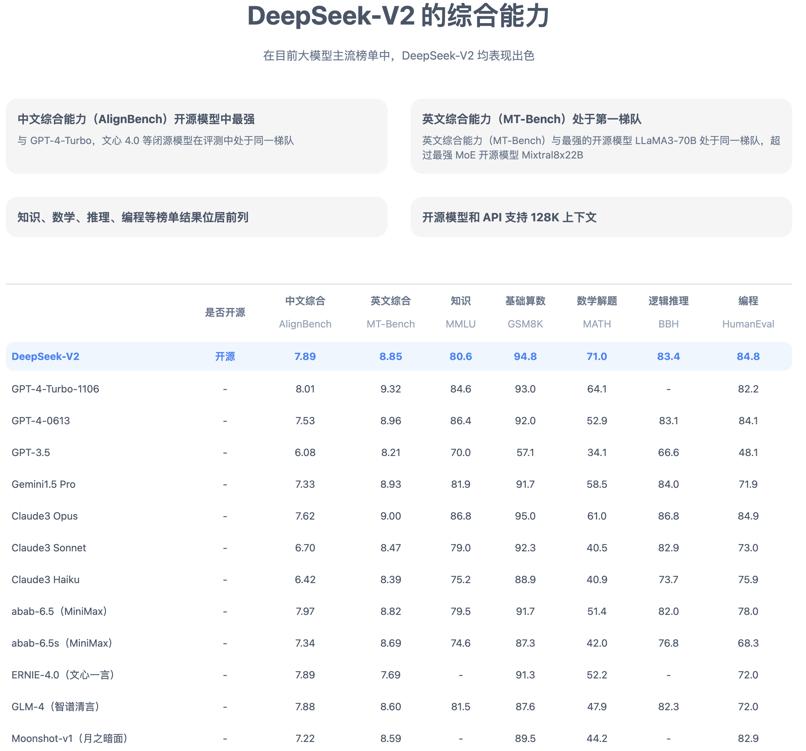
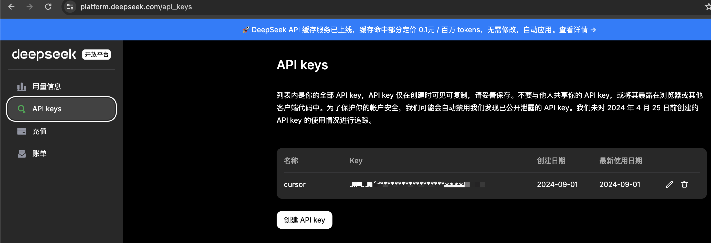
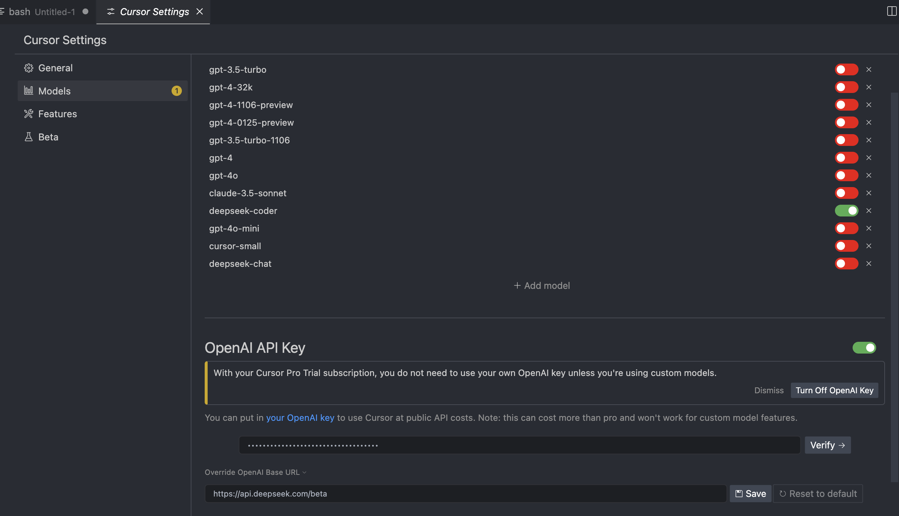
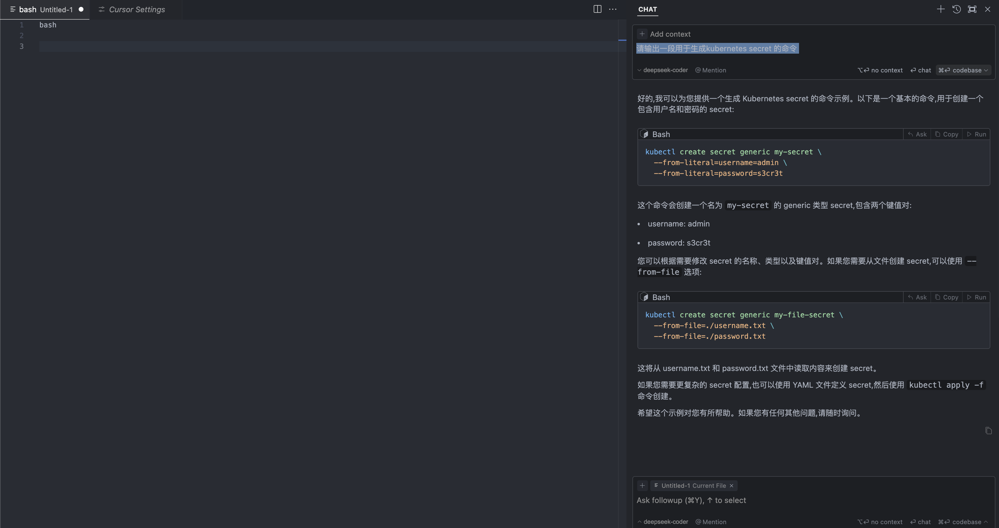
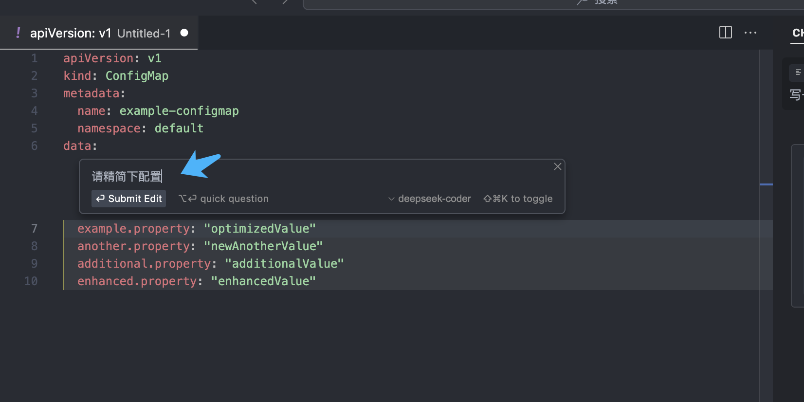

# AI辅助编程工具：Cursor与deepseek-coder结合

最近各开发大佬在铺天盖地推荐Cursor，看来它确实有过人之处，决定试用一下。

## Cursor简介

官网：`https://www.cursor.com/`

Cursor 是一个以 AI 为核心的代码编辑器，它通过智能自动完成、多行编辑、智能重写等功能来提高软件开发效率，同时提供了与 AI 对话的能力，以帮助开发者理解和操作代码库。下载Cursor的本质是下载了一个高度集成Cursor的VScode所以VScode可以做的它也可以做。

### 特性

- 多行编辑：Cursor 支持多行编辑，除了可以像其他 ai 插件一样生成代码以外，还可以基于现有代码自动提示可能需要修改的地方，实际使体验非常顺滑，很多时候一路 tab 键就可以完成多行代码的编辑。
- AI 对话：Cursor 可以与 AI 对话，以帮助开发者理解和操作代码库。尤其值得一提的是，对话背后是个多模态模型，可以输入图片、代码、文本等，然后生成对应的代码。

### 费用

* Hobby：免费计划。包含两周 Pro 试用期、每月 2000 个代码补全（completions）、50 个慢速优先的高级请求（slow premium requests）和 200 次 Cursor-small 模型的使用。
* Pro：每月 $20，包括所有 Hobby 计划内容，并提供无限制的代码补全、每月 500 个快速优先的高级请求、无限制的慢速高级请求、无限制的 Cursor-small 使用以及每天 10 次 Claude Opus 使用。
* Business：每用户每月 $40，包括 Pro 计划内容，并增加了集中式账单、管理员使用情况仪表板、强制隐私模式和 OpenAI/Anthropic 零数据保留政策。

## Deepseek-coder 简介

官网：`https://www.cursor.com/`

从前面的介绍，我们可以看到 Cursor 功能还是很吸引人的，不过费用这块，还是有点高。除了使用免费计划，还可以考虑切换到白菜价的 deepseek。那什么是deepseek-coder 呢？

DeepSeek-Coder-V2 是由 DeepSeek AI 发布的最新代码生成模型，它在 DeepSeek-Coder-V1 的基础上进行了重大改进，在性能和功能方面都取得了显著提升。根据 DeepSeek AI 的官方说法，DeepSeek-Coder-V2 的性能与 GPT4-Turbo 相当，这意味着它已经达到了目前代码生成领域的最先进水平。从官网介绍的综合能力来看，确实很强。最重要的是开源，支持开源一波。

### 价格

真是白菜价，输入 1 元/ 1 百万 tokens（命中缓存 0.1元百万 tokens），输出 2 元/ 1 百万 tokens。

## 使用方法

1、在 deeseek注册登录`https://platform.deepseek.com/`，并在 API Keys 中提前创建`API key`

2、在 cursor settings界面设置模型，具体如下截图所示，点击+ Add model 添加模型：`deepseek-coder`。并设置OpenAI API Key，输入deepseek-coder的api密钥，需要特别注意的是需要点开Overwrite OpenAI Base URL，里面输入 `https://api.deepseek.com/beta`。

说明：deepseek正在对 [Chat Completion API](https://platform.deepseek.com/api-docs/zh-cn/api/create-chat-completion) 的 8K 最大输出长度进行 Beta 测试，您需要设置 `base_url="https://api.deepseek.com/beta"` 来开启此功能，常规场景使用`https://api.deepseek.com`即可。

以上设置完成，点击`Save`后，执行`Verify`进行校验，校验通过即可正常使用了。

3、接着来试用下。在 Cursor 中输入`command+L`，可快速开启一个新的对话框，先试写一串生菜 K8S  secret的命令，输入`请输出一段用于生成kubernetes secret 的命令 `，输出结果舒适。

==首先可以不用在浏览器/其他 AI 应用和编辑器之间来回切换==

4、让 Cursor 根据需要自动修正内容，选中要修正的代码，输入`command+K`，在对话框中输入你的需求，可实现自动修正代码。

整体体验良好，大家也用起来！
