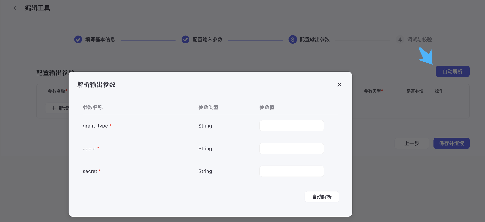

# 扣子-创建自定义插件

## 插件介绍

引用[扣子官网插件介绍](https://www.coze.cn/docs/guides/create_plugin)

> 插件是一个工具集，一个插件内可以包含一个或多个工具（API）。
>
> 目前，扣子集成了超过 60 种类型的插件，包括资讯阅读、旅游出行、效率办公、图片理解等 API 及多模态模型。使用这些插件，可以帮助您拓展 Bot 能力边界。例如，在您的 Bot 内添加新闻搜索插件，那么您的 Bot 将拥有搜索新闻资讯的能力。
>
> 如果扣子集成的插件不满足您的使用需求，您还可以创建自定义插件来集成需要使用的 API。
>
> 插件可以直接在 Bot 内使用，拓展 Bot 的能力边界。插件也可以作为节点添加到工作流，实现工作流的任务处理能力。

在扣子中，一个插件可包含多个工具。插件与工具的关系就是 API 服务与 API endpoint 的关系。在创建插件时，首先需要将这个 API 服务注册为一个插件，然后再将这个服务下的 API endpoint 添加到插件中作为工具使用，最后将插件发布上线。

## 创建自定义插件

扣子支持多种方式创建自定义插件：

* 基于已有服务创建插件
* 使用 Coze IDE 创建插件
* 通过 JSON 或 YAML 文件导入插件
* 使用代码注册插件

接下来将在个人空间中使用 Coze IDE 创建`获取公网出口IP`插件。

> 在 Coze IDE 中，可以借助 AI 轻松创建插件，无需关心开发环境。创建插件后，必须发布插件才可以被 Bot 使用。
>
> Coze IDE 是扣子提供的在线编码和运行环境，允许您在多种技术栈中创建插件。待插件发布后，IDE 会帮助您托管运行代码，您无需关心环境配置、服务部署等步骤。此外，您可以使用 IDE 内置的 AI 助手获取代码方面的帮助，包括生成代码、修改代码、解释代码和添加注释。
>
> 注意事项：
>
> - 在个人空间下创建的插件，仅能被个人调用。
> - 在团队空间下创建的插件，能被团队成员调用。
> - 插件发布了新版本后，使用了这个插件的 Bot 会自动使用发布的最新版本。

### 使用Coze IDE创建插件：获取公网出口IP

首先通过个人空间-插件-创建插件，进入新建插件入口，选择运行时`Python3`（按需，另外还支持Node.js）


填写插件名称、插件描述，选择`在Coze IDE中创建`


#### 新建工具：`coze_cn_get_public_ip`

功能：利用此工具循环执行最多100次，获取扣子运行环境公网出口IP列表，并实现排序去重。

代码部分在自动创建的代码基础上添加循环获取运行环境公网出口IP的逻辑

```python
from runtime import Args
from typings.coze_cn_get_public_ip.coze_cn_get_public_ip import Input, Output
import requests
from runtime import Args
import json,time

"""
Each file needs to export a function named `handler`. This function is the entrance to the Tool.

Parameters:
args: parameters of the entry function.
args.input - input parameters, you can get test input value by args.input.xxx.
args.logger - logger instance used to print logs, injected by runtime.

Remember to fill in input/output in Metadata, it helps LLM to recognize and use tool.

Return:
The return data of the function, which should match the declared output parameters.
"""
def handler(args: Args[Input])->Output:
    loop_count = args.input.count
    # 确保循环次数不大于100
    if loop_count > 100:
      loop_count = 100
    # 创建一个空数组来存储IP地址
    ip_address_list = []
    # 发送GET请求获取IP地址
    response = requests.get('http://ifconfig.me/ip', timeout=5)
    for i in range(loop_count):
      try:
        response = requests.get('http://ifconfig.me/ip')
        # 处理响应内容以提取IP地址，去除多余的空格和换行符
        ip_address = response.text.strip() 
        ip_address_list.append(ip_address) 
        time.sleep(0.5)
      except requests.RequestException as e:
        print(f'{i+1}. Request failed: {e}')
        ip_address_list.append(None)
    # 去重
    unique_ips = set(ip_address_list)
    # 排序
    sorted_ips = sorted(unique_ips)
    publicIPList = sorted_ips
    print(publicIPList)
    return publicIPList
```

注意部分依赖包`request`需要额外安装，选择`+`并输入名称进行搜索，点击添加


其中输入参数、输出参数按实际情况调整


插件要发布出去，需要进行测试代码，在控制台会输出测试的过程日志


最后发布。

代码不熟悉的情况下，可以利用扣子上已有的机器人，配合写代码，自己再微调。我在创建插件过程中就使用了Bot：[程序员的工具箱](https://www.coze.cn/s/i2SPtW9U/)，整体帮助较大。

**注意 ：使用Coze IDE创建插件所在的运行环境执行的公网出口IP清单，与居于已有服务创建插件的运行环境出口IP清单是不一样的。**

### 使用Coze IDE创建插件：微信公众号管理

#### 新建工具：`wechat_get_access_token`

功能：调用微信API接口获取access_token

微信API文档：`https://developers.weixin.qq.com/doc/offiaccount/Basic_Information/Get_access_token.html`

调用调用微信API接口获取access_token，需要先添加IP白名单到公众号配置中


依据微信API的接口文档，输入为：`grant_type、appid、secret`

输出为：`access_token`


### 基于已有服务创建插件：微信公众号管理插件

创建插件


创建工具


输入参数，因为当前接口使用的是get方法，参数类型选择"Query"


下一步输入输出参数。

可根据用户参数自动解析结果实现自动配置输出参数，需要填入正确的参数值



## 参考文档

扣子官方文档：https://www.coze.cn/docs/

手把手教你玩转Coze工作流，搭建一个自动更新内容到微信公众号的bot：https://mp.weixin.qq.com/s/ZxyGAASfQekfYdTJs13vRg


