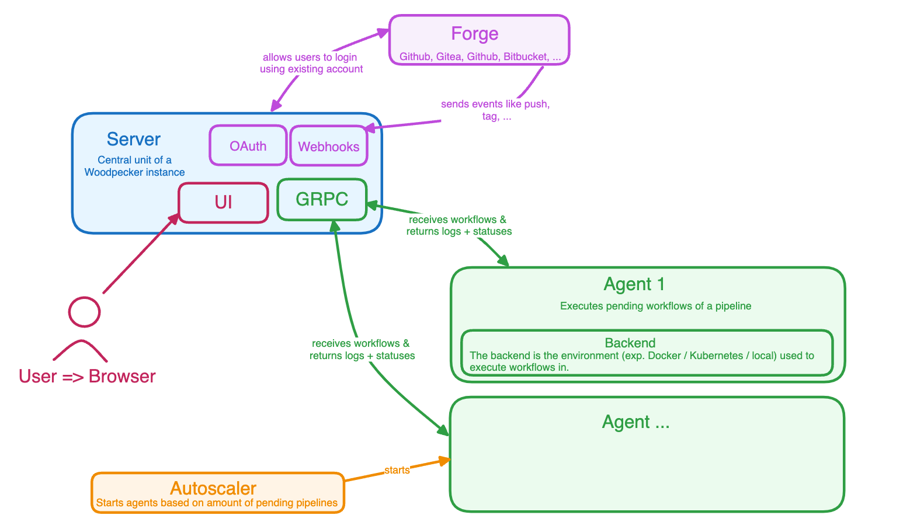
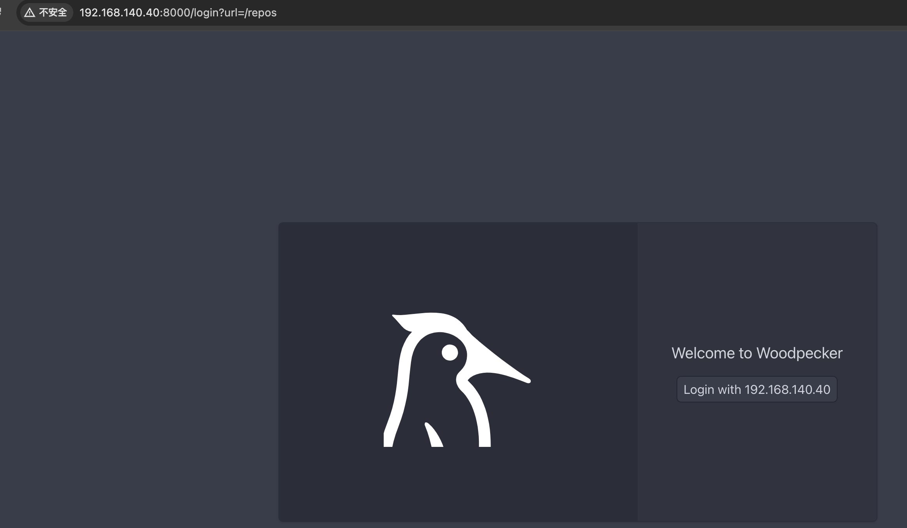
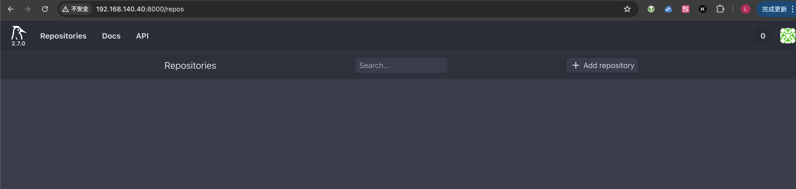

# 使用Woodpecker-CI与Gitea搭建纯开源的CI工具


## Gitea

docker-compose.yml

```yaml
version: "3"
networks:
  gitea:
    external: false
services:
  server:
    image: gitea/gitea:1.22.1
    container_name: gitea
    environment:
      - USER_UID=1000
      - USER_GID=1000
    restart: always
    networks:
      - gitea
    volumes:
      - ./gitea:/data
      - /etc/timezone:/etc/timezone:ro
      - /etc/localtime:/etc/localtime:ro
    ports:
      - "3000:3000"
      - "222:22"
```

注意选择gitea数值型版本，否则Woodpecker-CI登录时可能出现异常。


OAuth2应用名称：woodpecker-ci
重定向URI：http://192.168.140.40:8000/authorize
客户端ID：在Gitea中配置获取
客户端密钥：在Gitea中配置获取

## Woodpecker-CI



新建目录

```bash
mkdir ~/woodpecker-ci
cd ~/woodpecker-ci
```

新建`docker-compose.yml`

```yaml
version: '3'

services:
  woodpecker-server:
    image: woodpeckerci/woodpecker-server:latest
    ports:
      - 8000:8000
    volumes:
      - woodpecker-server-data:/var/lib/woodpecker/
    environment:
      - WOODPECKER_OPEN=true
      - WOODPECKER_HOST=${WOODPECKER_HOST}
#      - WOODPECKER_GITHUB=true
#      - WOODPECKER_GITHUB_CLIENT=${WOODPECKER_GITHUB_CLIENT}
#      - WOODPECKER_GITHUB_SECRET=${WOODPECKER_GITHUB_SECRET}
      - WOODPECKER_GITEA=true
      - WOODPECKER_GITEA_URL=${WOODPECKER_GITEA_URL}
      - WOODPECKER_GITEA_CLIENT=${WOODPECKER_GITEA_CLIENT}
      - WOODPECKER_GITEA_SECRET=${WOODPECKER_GITEA_SECRET}
      - WOODPECKER_GITEA_SKIP_VERIFY=true
      - WOODPECKER_AGENT_SECRET=${WOODPECKER_AGENT_SECRET}

  woodpecker-agent:
    image: woodpeckerci/woodpecker-agent:latest
    command: agent
    restart: always
    depends_on:
      - woodpecker-server
    volumes:
      - woodpecker-agent-config:/etc/woodpecker
      - /var/run/docker.sock:/var/run/docker.sock
    environment:
      - WOODPECKER_SERVER=woodpecker-server:9000
      - WOODPECKER_AGENT_SECRET=${WOODPECKER_AGENT_SECRET}

volumes:
  woodpecker-server-data:
  woodpecker-agent-config:
```

在同目录下创建 `.env` 环境变量文件

```bash
WOODPECKER_HOST=http://192.168.140.40:8000
WOODPECKER_GITEA_URL=http://192.168.140.40:3000
WOODPECKER_GITEA_CLIENT=在Gitea中配置获取
WOODPECKER_GITEA_SECRET=在Gitea中配置获取
WOODPECKER_GITEA_SKIP_VERIFY=true
WOODPECKER_AGENT_SECRET=自定义一个
```

启动

```bash
docker-compose up -d
```

登录访问`http://192.168.140.40:8000`



登录后会显示可访问的仓库



## 问题解决

> Error while authenticating against OAuth provider
>
> {"level":"error","error":"Post \"http://192.168.140.40:3000/login/oauth/access_token\": dial tcp 192.168.140.40:3000: connect: connection refused","time":"2024-09-03T09:15:59Z","message":"cannot authenticate user"}

解决：因使用docker 部署，使用192.168.140.40的方式会导致无法访问到另外一个 docker，需要修改网络为本地可通讯的 IP

```yaml
WOODPECKER_HOST=http://192.168.140.40:8000
WOODPECKER_GITEA_URL=http://192.168.140.40:3000
```


## 参考文档

https://blog.csdn.net/qq_41468830/article/details/135667503?spm=1001.2014.3001.5501

https://blog.csdn.net/qq_41468830/article/details/135726671
