# 专属镜像源：利用Cloudflare部署属于自己的docker镜像源

## 引言

由于网络限制，国内用户无法直接从Docker官方仓库正常获取Docker镜像，同时也无法访问Docker官网。近期，受监管政策影响，众多高校及容器技术社区不得不关闭了多个镜像加速服务站点。此外，即使在网络条件允许的情况下，Mac用户需登录Docker Desktop后才能顺利拉取镜像。

据网络社区讨论，有用户通过利用Cloudflare的Workers和Pages服务成功实现了Docker镜像的拉取，决定动手尝试一下。

## 简介

Cloudflare公司

* 简介：Cloudflare是一家提供网络基础设施和安全服务的美国公司，成立于2010年，总部位于旧金山。Cloudflare的宗旨是通过其平台保护网站、应用程序和API免受各种网络攻击，同时提高其性能和可靠性。
* 官网：`https://www.cloudflare.com/`

前置条件

* 有自己的[github](https://github.com)账号，且能正常访问，国内有时候访问比较慢，依赖项目：[cloudflare-docker-proxy](https://github.com/ciiiii/cloudflare-docker-proxy)
* 有cloudflare账号，且能正常访问，国内有时候访问比较慢
* 有自己的域名，用于访问docker镜像的地址，且该域名需要托管在cloudflare上（使用其DNS解析服务器）

## 配置说明

### github配置

首先 fork [https://github.com/ciiiii/cloudflare-docker-proxy](https://link.segmentfault.com/?enc=rWI4UnDPimGRUO%2FHlwH8tQ%3D%3D.Qkes8%2BKVQcLcu4ycCRaWUPSoFMZpPVtxEj9r%2FfmtJEdFHlSRaaCBlm2emOiPELzxN%2F4BNRUQkpaaXavNGwu9yw%3D%3D) 仓库到自己账号下：`https://github.com/luyx30/cloudflare-docker-proxy`。

然后修改 `src/index.js`，修改内容按自己的域名如下，其中 mydomain.com 就是你的域名

```js
const routes = {
  "docker.mydomain.com": dockerHub,
  "quay.mydomain.com": "https://quay.io",
  "gcr.mydomain.com": "https://gcr.io",
  "k8s-gcr.mydomain.com": "https://k8s.gcr.io",
  "k8s.mydomain.com": "https://registry.k8s.io",
  "ghcr.mydomain.com": "https://ghcr.io",
  "cloudsmith.mydomain.com": "https://docker.cloudsmith.io",
  
  // staging
  "docker-staging.mydomain.com": dockerHub,
};
```

再修改 `wrangler.toml`，同样是替换域名，其中 mydomain.com 就是你的域名

```toml
[env.production]
name = "cloudflare-docker-proxy"
routes = [
  { pattern = "docker.mydomain.com", custom_domain = true },
  { pattern = "quay.mydomain.com", custom_domain = true },
  { pattern = "gcr.mydomain.com", custom_domain = true },
  { pattern = "k8s-gcr.mydomain.com", custom_domain = true },
  { pattern = "k8s.mydomain.com", custom_domain = true },
  { pattern = "ghcr.mydomain.com", custom_domain = true },
  { pattern = "cloudsmith.mydomain.com", custom_domain = true },
]

[env.production.vars]
MODE = "production"
TARGET_UPSTREAM = ""

[env.staging]
name = "cloudflare-docker-proxy-staging"
route = { pattern = "docker-staging.mydomain.com", custom_domain = true }
```

最后修改 README.md 中的图标对应的 Github 仓库地址为你 fork 后的仓库地址，这三个修改都完成后，提交代码。

为了便于使用，可以在访问根目录时返回一个帮助页面。新建一个帮助页面`src/help.html`。

```html
<!DOCTYPE html>
<html lang="zh-CN">
<head>
    <meta charset="utf-8">
    <meta name="viewport" content="width=device-width, initial-scale=1">
    <title>镜像使用说明</title>
    <style>
        body {
            font-family: 'Roboto', sans-serif;
            margin: 0;
            padding: 0;
            background-color: #f4f4f4;
        }
        .header {
            background: linear-gradient(135deg, #667eea, #764ba2);
            color: #fff;
            padding: 20px 0;
            text-align: center;
            box-shadow: 0 2px 4px rgba(0, 0, 0, 0.1);
            position: relative;
        }
        .github-link {
            position: absolute;
            top: 10px;
            right: 20px;
            color: #fff;
            text-decoration: none;
        }
        .github-icon {
            width: 24px;
            height: 24px;
            vertical-align: middle;
        }
        .container {
            max-width: 800px;
            margin: 40px auto;
            padding: 20px;
            background-color: #fff;
            box-shadow: 0 4px 8px rgba(0, 0, 0, 0.1);
            border-radius: 10px;
        }
        .content {
            margin-bottom: 20px;
        }
        .footer {
            text-align: center;
            padding: 20px 0;
            background-color: #333;
            color: #fff;
        }
        pre {
            background-color: #272822;
            color: #f8f8f2;
            padding: 15px;
            border-radius: 5px;
            overflow-x: auto;
        }
        code {
            font-family: 'Source Code Pro', monospace;
        }
        a {
            color: #4CAF50;
            text-decoration: none;
        }
        a:hover {
            text-decoration: underline;
        }
        @media (max-width: 600px) {
            .container {
                margin: 20px;
                padding: 15px;
            }
            .header {
                padding: 15px 0;
            }
        }
    </style>
    <link href="https://fonts.googleapis.com/css2?family=Roboto:wght@400;700&family=Source+Code+Pro:wght@400;700&display=swap" rel="stylesheet">
</head>
<body>
<div class="header">
    <h1>镜像使用说明</h1>
    <a href="https://github.com/lixd/cloudflare-docker-proxy" target="_blank" class="github-link">
        
    </a>
</div>
<div class="container">
    <div class="content">
        <p>为了加速 Docker 镜像拉取，你可以使用以下命令设置 registry mirror:</p>
        <pre><code id="registry-config">sudo tee /etc/docker/daemon.json &lt;&lt;EOF
{
    "registry-mirrors": ["https://{{host}}"]
}
EOF
# 配置完后需要重启 Docker 服务
sudo systemctl restart docker
</code></pre>
        <p>使用该代理从不同的镜像仓库拉取镜像，请参考以下命令：</p>
        <pre><code id="commands">
# docker pull nginx:latest
docker pull docker.{{host}}/library/nginx:latest  # 拉取 Docker 官方镜像

# docker pull quay.io/coreos/etcd:latest
docker pull quay.{{host}}/coreos/etcd:latest  # 拉取 Quay 镜像

# docker pull gcr.io/google-containers/busybox:latest
docker pull gcr.{{host}}/google-containers/busybox:latest  # 拉取 GCR 镜像

# docker pull k8s.gcr.io/pause:latest
docker pull k8s-gcr.{{host}}/pause:latest  # 拉取 k8s.gcr.io 镜像

# docker pull registry.k8s.io/pause:latest
docker pull k8s.{{host}}/pause:latest  # 拉取 registry.k8s.io 镜像

# docker pull ghcr.io/github/super-linter:latest
docker pull ghcr.{{host}}/github/super-linter:latest  # 拉取 GitHub 容器镜像

# docker pull docker.cloudsmith.io/public/repo/image:latest
docker pull cloudsmith.{{host}}/public/repo/image:latest  # 拉取 Cloudsmith 镜像
</code></pre>
        <p>为了避免 Worker 用量耗尽，你可以手动 pull 镜像然后 re-tag 之后 push 至本地镜像仓库。</p>
    </div>
</div>
<div class="footer">
    <p>Powered by Cloudflare Workers</p>
    <p><a href="https://github.com/luyx30" target="_blank">卢影随行</a></p>
</div>
<script>
    document.addEventListener('DOMContentLoaded', function() {
        const host = window.location.hostname;
        const mainDomain = host.split('.').slice(-2).join('.');
        const registryConfigElement = document.getElementById('registry-config');
        const commandsElement = document.getElementById('commands');

        registryConfigElement.innerHTML = registryConfigElement.innerHTML.replace(/{{host}}/g, host);
        commandsElement.innerHTML = commandsElement.innerHTML.replace(/{{host}}/g, mainDomain);
    });
</script>
</body>
</html>
```

在`scr/index.js` 增加一条路由,访问根目录时就返回这个帮助页面

```js
//开头添加
import DOCS from './help.html'

......
......
......

// return docs，约第47行添加
if (url.pathname === "/") {
  return new Response(DOCS, {
    status: 200,
    headers: {
      "content-type": "text/html"
    }
  });
}
```

### Cloudflare配置

说明：

* 1、注册Cloudflare账号，这个步骤属于常规操作，这里不再详述

*  2、域名注册申请可参考[其他文章](https://blog.csdn.net/m0_58606834/article/details/124493114)，本人是直接购买的 ，未参考进行测试，这里不再详述

#### 域名托管在Cloudflare

添加域，选择Free计划

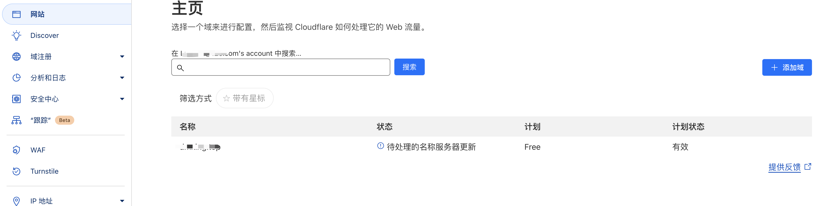

在 Cloudflare上激活，需要修改 DNS服务器

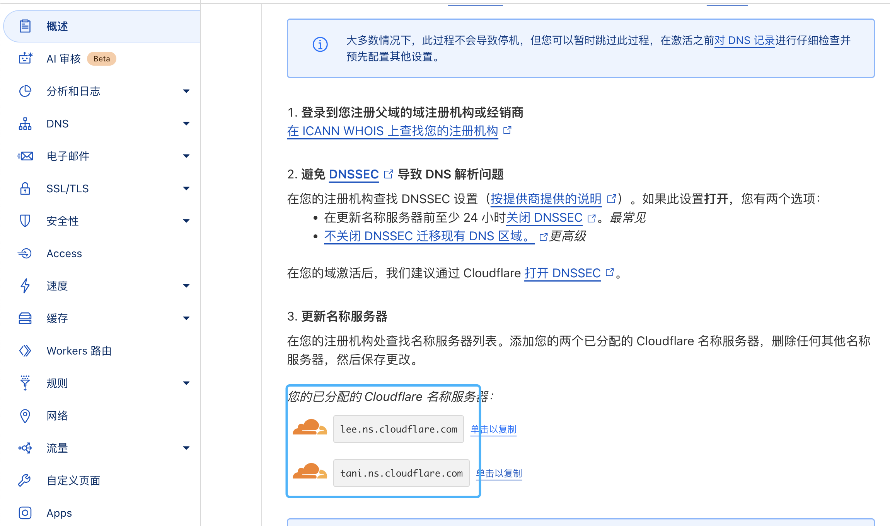

配置完成之后，等待一定时间让其生效，出现这个提示就表示配置成功了。 

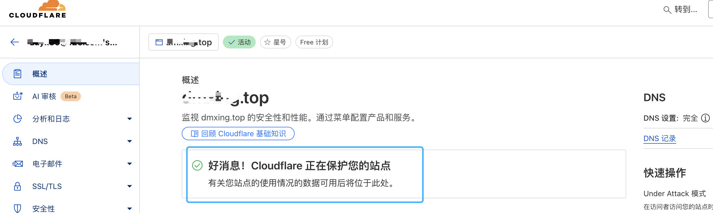

==特别注意：托管后，原有域名解析配置也同样被托管，如存在异常，注意将代理状态 改成：`仅DNS`。==

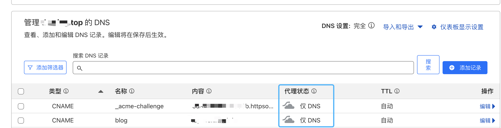

#### 配置workers-and-pages

查看帐户 ID，访问workers-and-pages

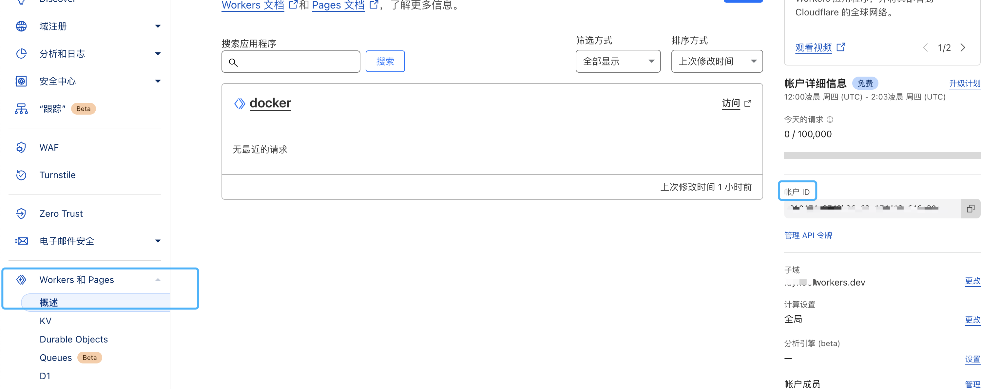

创建 API Token，路径：我的个人资料-API令牌，选编辑 Cloudflare Workers 这个模板

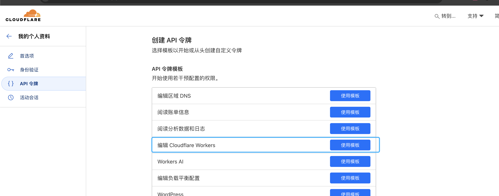

注意需要选择

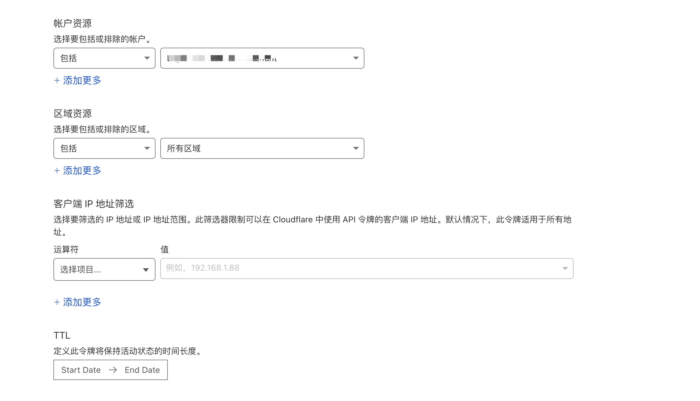

然后在 Github 界面点击这个`Deploy with Workers`图标进行部署，会自动跳转到 cloudflare，按步骤操作即可，最终会在 Github 仓库中创建一个 Github Action 来将该仓库部署到 Cloudflare Workers。

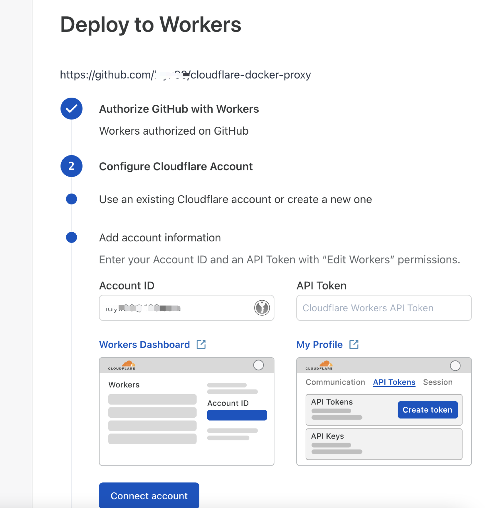

Enable GitHub Actions

Go to your new repository’s Actions page in GitHub and enable GitHub Actions. To continue setup, return here.

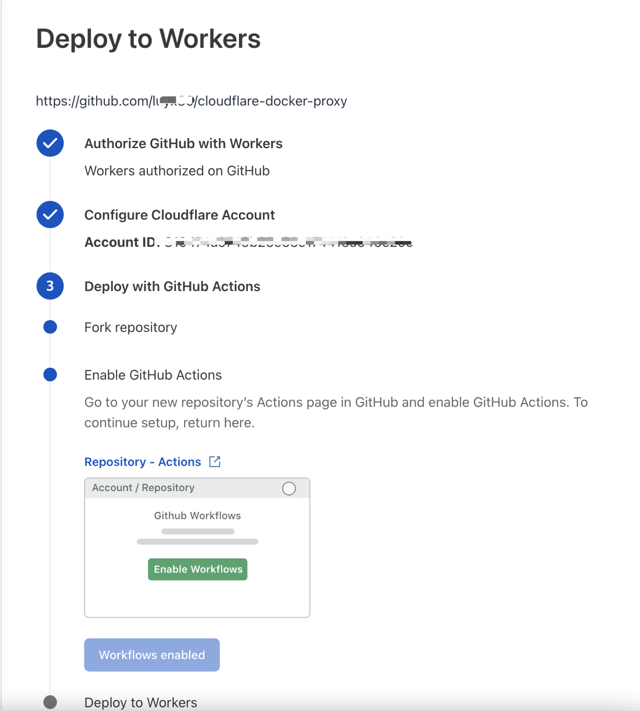

配置成功，可以到 Github 查看 Action 执行进度。

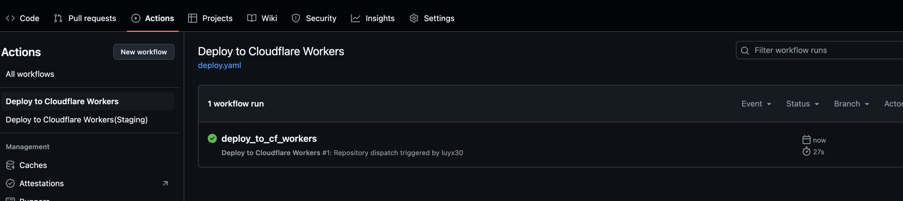

执行完成后，切换到 Cloudflare Dashboard，不出意外的话就可以看到刚创建的 Worker 了。

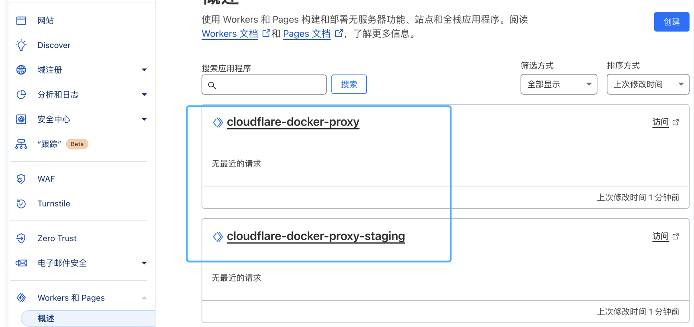

在这个域名的 DNS 记录中，会自动添加对应类型的域名解析。

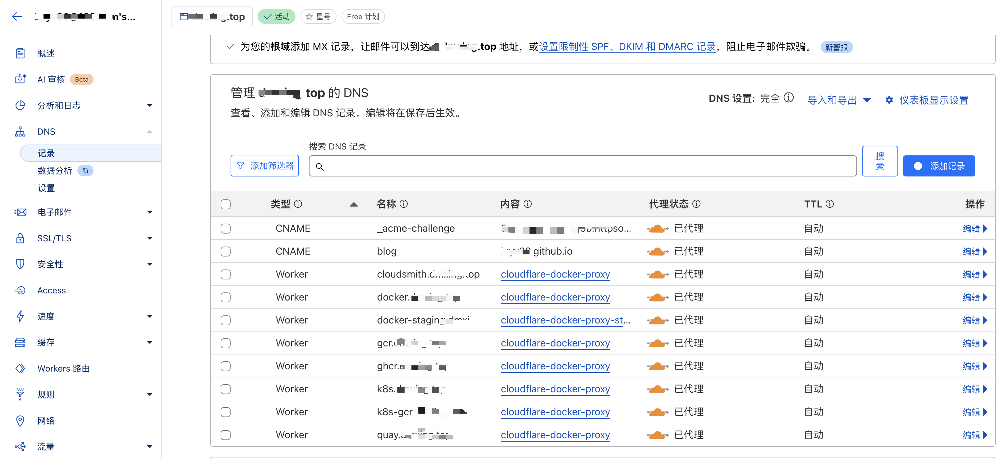

此时通过执行域名解析，已经可以看到生效了

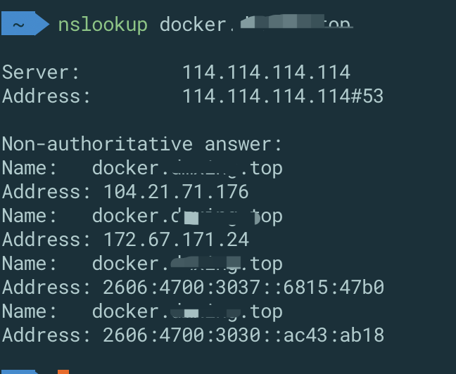

#### 测试

经以上配置后，可使用自定义域名执行拉取镜像测试。现在大家有了一个属于自己的docker镜像源。

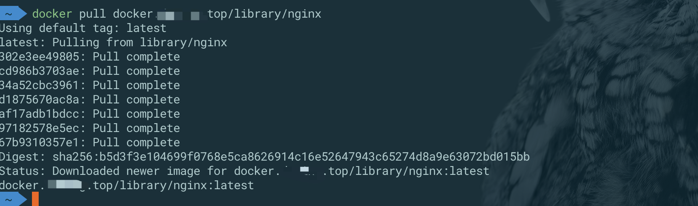

## 参考文档

https://segmentfault.com/a/1190000044985650

https://blog.csdn.net/u010784529/article/details/140190170

https://blog.bwcxtech.com/posts/%E4%BD%BF%E7%94%A8cf-workers%E6%90%AD%E5%BB%BAdocker-proxy/

https://weycen.com/post/transfer-alibaba-cloud-dns-records-to-cloudflare/
