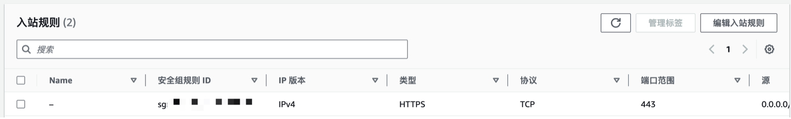
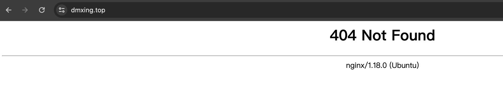

# 3、安装部署nginx作为web服务器

官网：https://apisix.apache.org/

安装nginx

```Bash
sudo apt-get install nginx
```

调整nginx配置，使用 https，并配置dmxing.top域名，其中ssl证书文件见下一章

```Nginx
       server {
            #listen       [::]:443 ssl http2;
            listen     443 ssl http2;
            server_name www.dmxing.top dmxing.top;

            ssl_certificate "/etc/nginx/dmxing_top.pem";
            ssl_certificate_key "/etc/nginx/dmxing_top.key";
            ssl_session_cache shared:SSL:1m;
            ssl_session_timeout  10m;
            ssl_prefer_server_ciphers on;
            ssl_protocols TLSv1.1 TLSv1.2 TLSv1.3;
            add_header Strict-Transport-Security "max-age=31536000";
            #禁止已经不安全的加密算法
            #ssl_ciphers EECDH+CHACHA20:EECDH+AES128:RSA+AES128:EECDH+AES256:RSA+AES256:EECDH+3DES:RSA+3DES:!MD5;
            ssl_ciphers 'ECDHE-RSA-AES256-GCM-SHA384:ECDHE-RSA-AES128-GCM-SHA256:DHE-RSA-AES256-GCM-SHA384:DHE-RSA-AES128-GCM-SHA256:ECDHE-RSA-AES256-SHA384:ECDHE-RSA-AES128-SHA256:ECDHE-RSA-AES256-SHA:ECDHE-RSA-AES128-SHA:DHE-RSA-AES256-SHA256:DHE-RSA-AES128-SHA256:DHE-RSA-AES256-SHA:DHE-RSA-AES128-SHA:!ECDHE-RSA-DES-CBC3-SHA:!EDH-RSA-DES-CBC3-SHA:AES256-GCM-SHA384:AES128-GCM-SHA256:AES256-SHA256:AES128-SHA256:AES256-SHA:AES128-SHA:!DES-CBC3-SHA:HIGH:!aNULL:!eNULL:!EXPORT:!CAMELLIA:!DES:!MD5:!PSK:!RC4:!3DES';

            error_page 404 /404.html;
                location = /40x.html {
            }

            error_page 500 502 503 504 /50x.html;
                location = /50x.html {
            }

            location / {
                return 404;
            }
        }
```

启动nginx

```Bash
sudo systemctl enable nginx
sudo systemctl start nginx
```

需要防火墙放开443端口



访问页面测试

