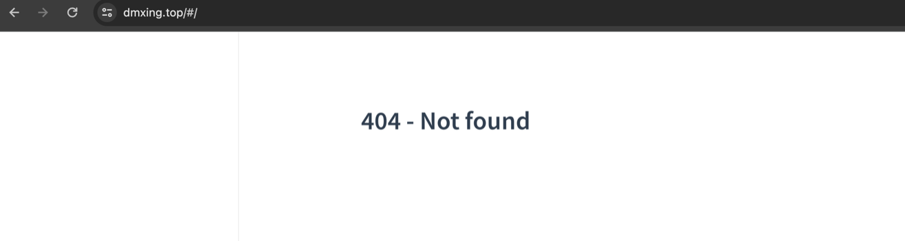
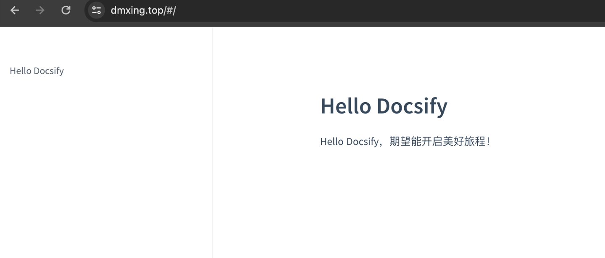
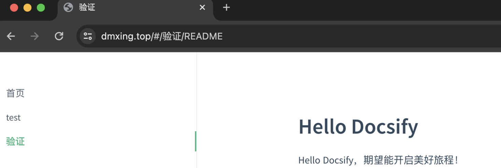
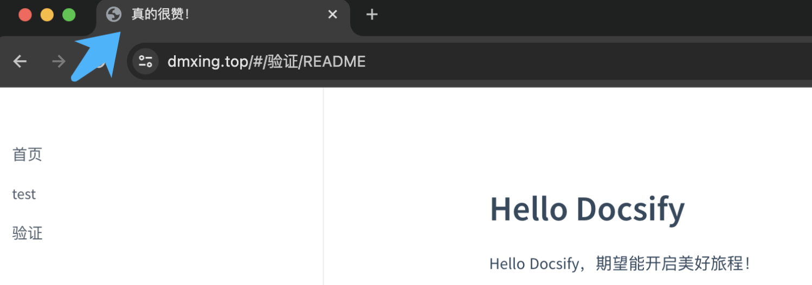
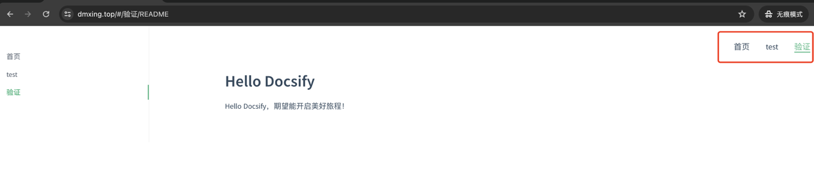
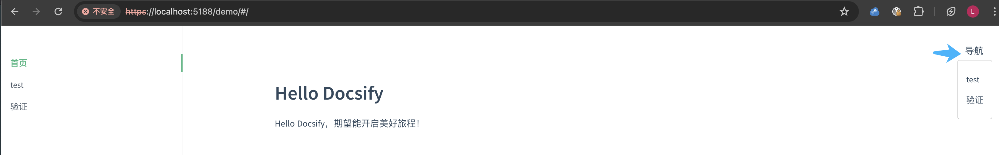
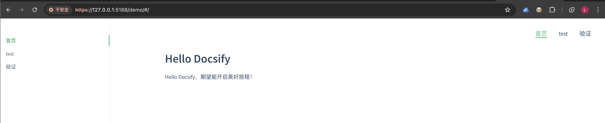

# 5、在服务器上利用nginx+Docsify建个人博客

## 背景

一直在寻找一个可以快速建站的方式，个人平常钟爱markdown格式，如果能直接用markdown文档快速建站，归档文件，就很美妙了。最终参考这边文章：https://juejin.cn/post/7002911266385707022，发现了Docsify。

以下是关于 Docsify的介绍信息：

> Docsify ，官网为：[docsify.js.org](https://link.juejin.cn?target=http%3A%2F%2Flink.zhihu.com%2F%3Ftarget%3Dhttps%3A%2F%2Fdocsify.js.org) 。口号是一个神奇的文档网站生成器。
>
> 当我发现它时，感觉遇到了宝藏，非常兴奋。无需构建和编译成html，直接发布markdown 就搞定。
>
> 你要的主题和插件,我都帮你找到,放这里。[github.com/docsifyjs/a…](https://link.juejin.cn?target=http%3A%2F%2Flink.zhihu.com%2F%3Ftarget%3Dhttps%3A%2F%2Fgithub.com%2Fdocsifyjs%2Fawesome-docsify) 。
>
> 使用它的公司，也个个大牌，比如：
>
> 饿了么
>
> [elemefe.github.io/vue-amap](https://link.juejin.cn?target=http%3A%2F%2Flink.zhihu.com%2F%3Ftarget%3Dhttps%3A%2F%2Felemefe.github.io%2Fvue-amap)
>
> 阿里巴巴
>
> [apache.github.io/incubator-w…](https://link.juejin.cn?target=http%3A%2F%2Flink.zhihu.com%2F%3Ftarget%3Dhttps%3A%2F%2Fapache.github.io%2Fincubator-weex-ui)
>
> Netflix
>
> [netflix.github.io/pollyjs/#/R…](https://link.juejin.cn?target=http%3A%2F%2Flink.zhihu.com%2F%3Ftarget%3Dhttps%3A%2F%2Fnetflix.github.io%2Fpollyjs%2F%23%2FREADME)
>
> Amazon
>
> [amzn.github.io/style-dicti…](https://link.juejin.cn?target=http%3A%2F%2Flink.zhihu.com%2F%3Ftarget%3Dhttps%3A%2F%2Famzn.github.io%2Fstyle-dictionary)
>
> 教学视频放在这里，欢迎自取。
>
> [www.bilibili.com/video/BV14U…](https://link.juejin.cn?target=http%3A%2F%2Flink.zhihu.com%2F%3Ftarget%3Dhttps%3A%2F%2Fwww.bilibili.com%2Fvideo%2FBV14U4y1x7jH)
>
> [www.bilibili.com/video/BV1kT…](https://link.juejin.cn?target=http%3A%2F%2Flink.zhihu.com%2F%3Ftarget%3Dhttps%3A%2F%2Fwww.bilibili.com%2Fvideo%2FBV1kT4y1T7wY)
>
> 
>
> 作者：悟空非空也
>
> 链接：https://juejin.cn/post/7002911266385707022
>
> 来源：稀土掘金
>
> 著作权归作者所有。商业转载请联系作者获得授权，非商业转载请注明出处。

官网：https://docsify.js.org/#/zh-cn/

## 部署

参考官网VPS方式在主机上部署

首先修改nginx配置

```Nginx
server {
  listen 443;
  ......

  location / {
    alias /web/;
    index index.html;
  }
}
```

重载生效

```Bash
sudo systemctl reload nginx
```

手动新建/web/web/docs/index.html

```HTML
<!DOCTYPE html>
<html>
<head>
  <meta http-equiv="X-UA-Compatible" content="IE=edge,chrome=1">
  <meta name="viewport" content="width=device-width,initial-scale=1">
  <meta charset="UTF-8">
  <link rel="stylesheet" href="//cdn.jsdelivr.net/npm/docsify/themes/vue.css">
</head>
<body>
  <div id="app"></div>
  <script>
    window.$docsify = {//...}</script>
  <script src="//cdn.jsdelivr.net/npm/docsify/lib/docsify.min.js"></script>
</body>
</html>
```

其中js和css用了外部资源，直接手动下载到/web/docs目录下，并替换成本地链接如下

```HTML
<!DOCTYPE html>
<html>
<head>
  <meta http-equiv="X-UA-Compatible" content="IE=edge,chrome=1">
  <meta name="viewport" content="width=device-width,initial-scale=1">
  <meta charset="UTF-8">
  <link rel="stylesheet" href="//www.dmxing.top/vue.css">
</head>
<body>
  <div id="app"></div>
  <script>
    window.$docsify = {//...}</script>
  <script src="//www.dmxing.top/docsify.min.js"></script>
</body>
</html>
```

查看效果



因为还没有放置README.md文件到目录下，导致404，先手动放置一个，内容如下

```Markdown
# Hello Docsify
Hello Docsify，期望能开启美好旅程！
```

查看效果



## 优化

### 定制侧边栏

为了获得侧边栏，您需要创建自己的_sidebar.md，或自定义加载的文件名。默认情况下侧边栏会通过 Markdown 文件自动生成。

修改index.html，开启侧边栏，并自定义侧边栏为：_summary.md

```HTML
  <script>
    window.$docsify = {
    // 加载侧边栏
    loadSidebar: true,
    // 自定义侧边栏:_summary.md
    loadSidebar: '_summary.md',
  }
  </script>
```

修改_summary.md内容

```Markdown
<!-- docs/_summary.md -->

* [首页](/)
* [test](test/README)
* [验证](验证/README)
```

查看效果，符合预期



一个页面的 `title` 标签是由侧边栏中选中条目的名称所生成的。为了更好的 SEO ，可以在文件名后面指定页面标题，例如将验证页面的标题改成：真的很赞！

修改_summary.md内容

```Markdown
<!-- docs/_summary.md -->

* [首页](/)
* [test](test/README)
* [验证](验证/README "真的很赞！")
```

效果如下



### 开启侧边栏目录功能

自定义侧边栏同时也可以开启目录功能。设置 `subMaxLevel` 配置项

修改index.html

```HTML
  <script>
    window.$docsify = {
    // 加载侧边栏
    loadSidebar: true,
    // 自定义侧边栏:_summary.md
    loadSidebar: '_summary.md',
    // 定义展示目录的层级
    subMaxLevel: 2,
  }
  </script>
```

效果

...

### 自定义导航栏

通过自定义配置文件方式来调整导航栏，首先配置 `loadNavbar`，默认加载的文件为 `_navbar.md`

```HTML
<!-- index.html -->

<script>
  window.$docsify = {
    loadNavbar: true
  }
</script>
```

新建修改`_navbar.md`

```Markdown
* [test](test/README)
* [验证](验证/README "真的很赞！")
```

查看效果



如果导航内容过多，可以写成嵌套的列表，会被渲染成下拉列表的形式，修改`_navbar.md`

```markdown
* 导航
    * [test](test/README)
    * [验证](验证/README "真的很赞！")
```

查看效果



### 封面

封面的生成同样是从 markdown 文件渲染来的。开启渲染封面功能后在文档根目录创建 `_coverpage.md` 文件

修改index.html，增加`coverpage: true`

```HTML
<!-- index.html -->

<script>
  window.$docsify = {
    coverpage: true
  }
</script>
```

新建修改文件`_coverpage.md`

```
<!-- _coverpage.md -->


# dmxing.top <small>0.1</small>

> 记录生活

- 大模型
- 个人生活
- 随笔速记

[docsify官网](https://docsify.js.org/)
[进入本站](#dmxing)
```

新建`_meddia`目录，存放网站的icon.jpg（通过ai文生图方式先生产一个，再用美图秀秀抠出无背景色的100*100像素的图，用于测试）

效果


### 插件

#### 全文搜索


#### 谷歌统计


### 加入广告


## 本地开发

为方便整站代码进行版本化管理，接入gitlab，使用gitlab18个人账号下的仓库：`dmxingtop`

目录规划

```bash
dmxingtop
├── demo                                           ## 存放建站过程中的示例站点
└── docs                                             ## 存放建站的真实文件站点
    ├── xxxx.md
    └── assets                                       ## 存放对应md文件中的图片
        ├── xxx.jpg
```

真实要部署上线，则将docs内的文件按版本化归档并上传到站点。

本地macos上开发验证，则使用本地演示环境，在本地安装nginx，用于演示。

```bash
brew install nginx
```

调整nginx配置，只允许127.0.0.1访问

```nginx
    server {
        listen       5188 ssl http2;
        server_name localhost 127.0.0.1;

        root /etc/nginx;
        ssl_certificate "xxx.pem";
        ssl_certificate_key "xxx.key";
        ssl_session_cache shared:SSL:1m;
        ssl_session_timeout  10m;
        ssl_prefer_server_ciphers on;
        ssl_protocols TLSv1.1 TLSv1.2 TLSv1.3;
        add_header Strict-Transport-Security "max-age=31536000";
        #禁止已经不安全的加密算法
        ssl_ciphers EECDH+CHACHA20:EECDH+AES128:RSA+AES128:EECDH+AES256:RSA+AES256:EECDH+3DES:RSA+3DES:!MD5;

        error_page 404 /404.html;
            location = /40x.html {
        }

        error_page 500 502 503 504 /50x.html;
            location = /50x.html {
        }

        location /demo/ {
            allow 127.0.0.1;
            deny all;
            alias "/xxxxxxxx/dmxingtop/demo/";
            index index.html;
        }
    }
```

相关命令

```bash
#验证配置
sudo nginx -t
#启动
sudo nginx
#关闭
sudo nginx -s stop
#重载配置
sudo nginx -s reload
```

启动nginx后，查看地址：`https://127.0.0.1:5188/demo/`


