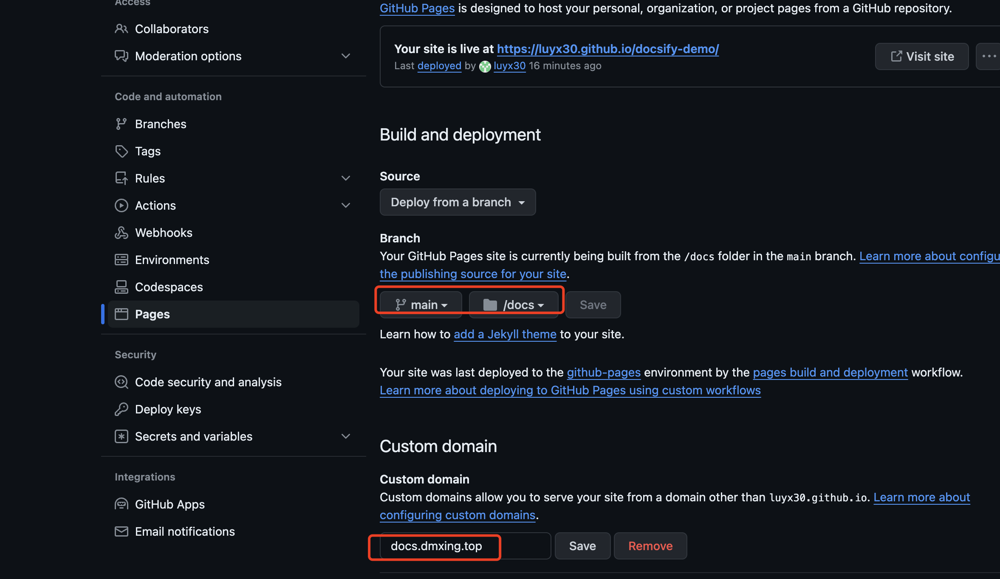
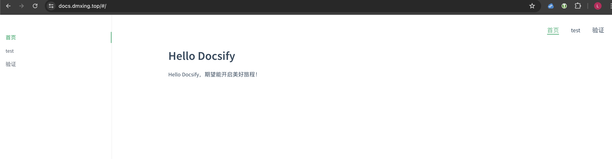

# 6、利用Docsify制作个人博客部署到GithubPages

## 前置条件

1、居于前文，已经定制了一个demo文档库，可直接用于上传到其他位置进行展示。

2、已经有github账号

3、能正常访问github.com

## 部署

### 新建仓库

先建一个Github仓库`https://github.com/luyx30/docsify-demo`，利用sourcetree，将docsify-demo项目文件推送上去。

遇到问题：SourceTree往GitHub推送时一直登陆失败，参考解决：`https://www.jianshu.com/p/cb70a53a6bf5`

在 SourceTree 中配置以使用 GitHub 基于令牌的认证方法，可以按照以下步骤进行：

1. 首先，需要在 GitHub 上生成个人访问令牌（Personal Access Token）。这可以通过登录到您的 GitHub 账户，然后点击右上角的头像图标，选择“Settings”进入个人设置页面。接着，点击左侧菜单中的“Developer settings”，再点击“Personal access tokens”，然后点击“Generate new token”按钮来创建一个新的令牌。
2. 在生成令牌时，您需要为令牌命名，并设置其权限。这些权限取决于您希望令牌能够执行的操作，例如读取或写入仓库等56。
3. 一旦令牌被创建并保存，接下来需要在 SourceTree 中配置该令牌。首先，打开 SourceTree，选择「File」菜单，然后选择「Preferences」。在偏好设置中，选择「Authentication」选项卡，然后点击「Add」按钮添加新的认证方法2。
4. 在添加认证方法的过程中，选择使用“Access Token”作为认证方式。此时，您需要输入之前在 GitHub 上生成的个人访问令牌的值。完成这一步骤后，保存更改。

通过以上步骤，您就可以在 SourceTree 中使用基于令牌的认证方法来访问 GitHub，这样不仅可以提高安全性，还可以避免频繁输入密码的麻烦。

注意：需要在 `./docs` 目录下创建一个 `.nojekyll` 文件，以防止 GitHub Pages 忽略下划线开头的文件，并提交到github。

### 准备子域名

提前准备子域名`docs.dmxing.top`，用于文档展示，并CNAME解析到 github  pages。

### 配置github pages

根据官方文档`https://docsify.js.org/#/zh-cn/deploy`

GitHub Pages 支持从三个地方读取文件

- `docs/` 目录
- master 分支
- gh-pages 分支

我们推荐直接将文档放在 `docs/` 目录下，在设置页面开启 **GitHub Pages** 功能并选择 `main branch /docs folder` 选项。修改 settings-Pages 配置

### 访问页面

**github.io页面**

Github也为每个账户提供一个免费的子域名：账号.github.io，需要建一个命名为"账号.github.io"仓库，把项目文件推上到此仓库，再配置一下Github Pages的属性即可通过"账号.github.io"访问此项目。

访问github pages 页面即可访问。地址：`https://luyx30.github.io/docsify-demo/#/`

**自定义域名页面**

配置了自定义子域名后，也可通过自定义子域名访问：https://docs.dmxing.top/#/

## 参考文档

GitHub Pages部署：https://docsify.js.org/#/zh-cn/deploy

Docsify 配合 Github Pages 搭建一个自己的云笔记：https://developer.aliyun.com/article/1412383

SourceTree拉取pull代码和推送push代码报错问题：https://www.jianshu.com/p/cb70a53a6bf5

使用开源文档工具docsify，用写博客的姿势写文档：https://blog.csdn.net/weixin_50666791/article/details/108607385

GitHub.io/Github Pages使用教程：https://blog.csdn.net/Xminyang/article/details/125239381
