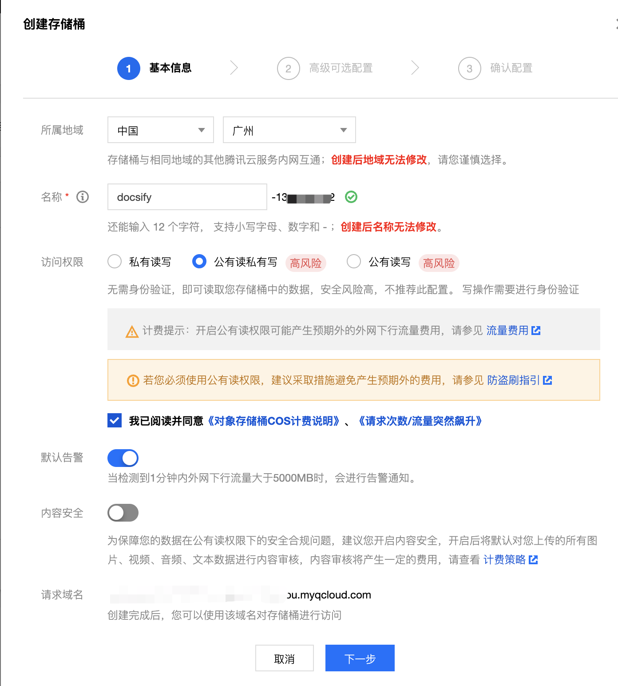
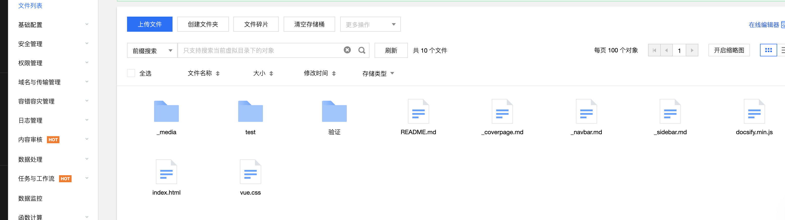
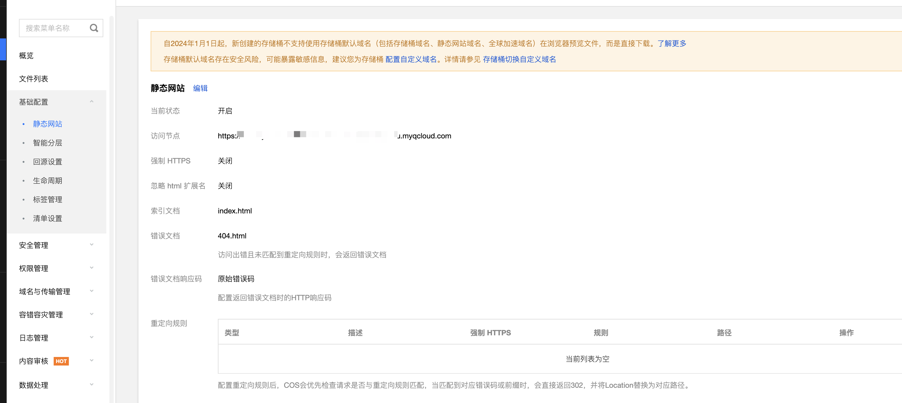
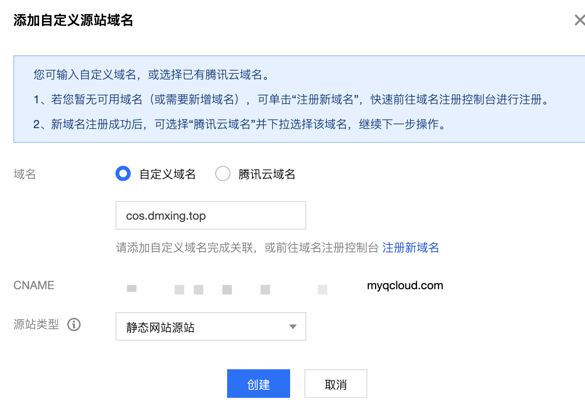

# 6、利用Docsify制作个人博客部署到腾讯云COS

## 前置条件

1、居于前文，已经定制了一个demo文档库，可直接用于上传到其他位置进行展示。

2、已经有腾讯云账号。

3、已开通腾讯云COS，腾讯云新用户有六个月的COS免费试用特权，建议尝鲜。

## 部署

先创建一个对象存储的桶设置为**公有读私有写**：

接着把整个demo项目中的文件拷贝到桶中，**index.html文件必须在桶的根目录**

然后配置桶的基本配置 - 静态网站中的索引文档（主页）如下：

自2024年1月1日起，新创建的存储桶不支持使用存储桶默认域名（包括存储桶域名、静态网站域名、全球加速域名）在浏览器预览文件，而是直接下载，为存储桶 [配置自定义域名](https://console.cloud.tencent.com/cos/bucket?bucket=docsify-1300468982&region=ap-guangzhou&type=domainconfig&anchorType=customizeDomain)

访问页面。因在国内域名未备案无法绑定，暂时作罢，方案可行。

## 参考文档

GitHub Pages部署：https://docsify.js.org/#/zh-cn/deploy

Docsify 配合 Github Pages 搭建一个自己的云笔记：https://developer.aliyun.com/article/1412383

SourceTree拉取pull代码和推送push代码报错问题：https://www.jianshu.com/p/cb70a53a6bf5

使用开源文档工具docsify，用写博客的姿势写文档：https://blog.csdn.net/weixin_50666791/article/details/108607385

GitHub.io/Github Pages使用教程：https://blog.csdn.net/Xminyang/article/details/125239381
