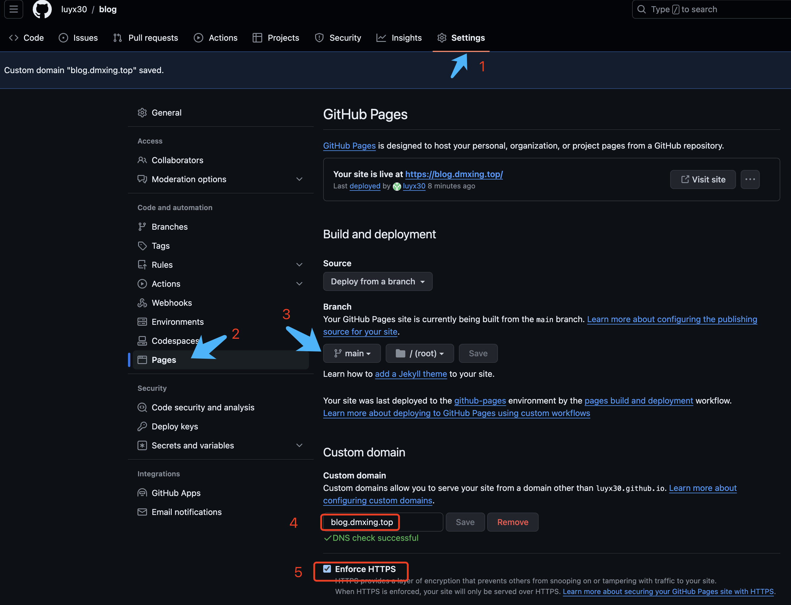
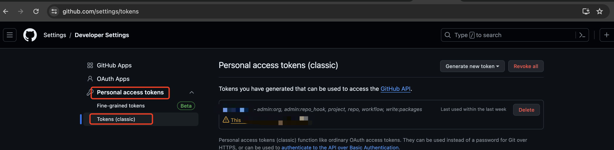

# github.com使用相关问题解决办法参考

1、将 github项目发布到 github pages



2、 sourcetree提交github代码，提示网络连接失败

使用代理服务来解决，在配置文件中添加配置

```bash
[http]
        proxy = socks5://127.0.0.1:7890
[https]
        proxy = socks5://127.0.0.1:7890
```

3、github从2021年开始不再支持直接使用账号密码方式提交代码，需要调整为使用`Passwordless sign-in with passkeys`

进入`Settings-Developer Settings-Personal access tokens -classic`，新建一个token配置到远程仓库的地址中，格式为：`https://token@github.com.....`



